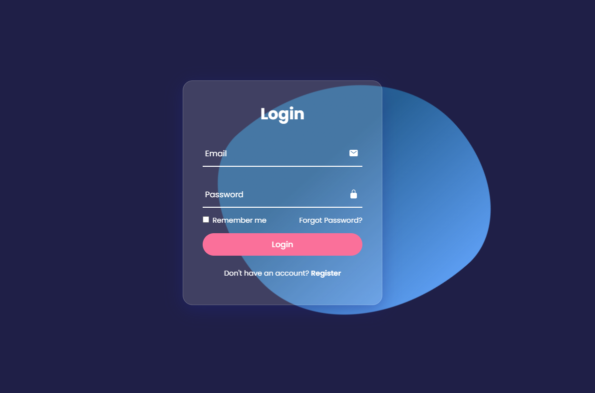

# Animated Transparent Login Form using HTML and CSS

## Description

This project showcases an eye-catching and interactive login form created solely with HTML and CSS. The login form features a transparent background, giving it a modern and stylish look. With smooth animations and intuitive design, users will have an engaging experience while logging in.

## Table of Contents

- [Animated Transparent Login Form using HTML and CSS](#project-name)
  - [Table of Contents](#table-of-contents)
  - [Description](#description)
  - [Demo](#demo)
  - [Screenshots](#screenshots)
  - [Installation](#installation)
  - [Usage](#usage)
  - [Technologies](#technologies)
  - [Features](#features)
  - [Contributing](#contributing)
  - [License](#license)
  - [Contact](#contact)

## Key Features

- Attractive transparent design: The login form has a visually appealing transparent background that blends seamlessly with any webpage or background.
- Smooth animations: When users interact with the form, they'll notice smooth animations for input fields, buttons, and other elements, enhancing the overall user experience.
- Simple and intuitive: The login form is user-friendly, making it easy for visitors to enter their credentials effortlessly.
- No JavaScript required: The entire animation and functionality are accomplished using only HTML and CSS, eliminating the need for JavaScript integration.

## Demo

[Live link]()

## Screenshots

## Installation

1. [Clone](https://github.com/your-username/your-repo.git) this repository.
2. Open the project folder in your code editor.

## Usage

Although this is a static page, we want to make sure you know how to use it effectively. Follow these simple steps to log in:

1. **Email**: In the "Username" field, enter your registered username. If you don't have an account yet, feel free to use the demo username provided below.
    - Demo Username: guest_user 

2. **Password**: Type the password associated with your account. For demo purposes, the password is demo123. However, in a real scenario, always use a strong and unique password.

3. **Login**: Once you've entered your username and password, click the "Login" button to proceed.

4. **Forgot Password**: If you forget your password, don't worry! Although this is a static page, in a real application, you could click the "Forgot Password" link to recover your account.

5. **New User? Sign Up**: Since this is a static page, there is no actual sign-up functionality. However, on a live website, you would click the "Sign Up" link to create a new account.

6. **Security Notice**: Please note that this is just a demonstration page, and no real authentication is taking place. Never use demo credentials or publicly shared credentials on real websites. Always use unique and secure credentials for your actual accounts.

## Technologies

- HTML
- CSS